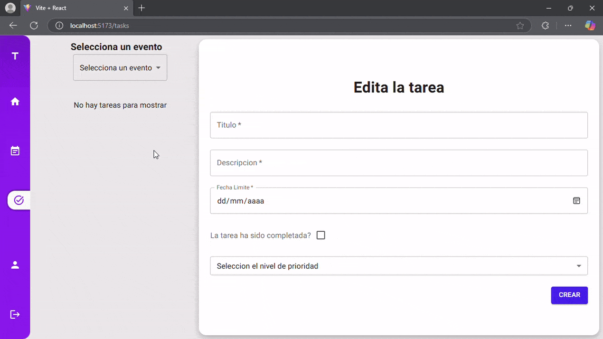

# EvenTTasker

## Descripcion

Aplicacion web para la gestion de eventos, tareas y de tareas relacionadas con eventos.

### Desarrollo

La estructura se penso en base a la arquitectura de Domain-Driven File Structuring.  
Se utilizan componentes y servicios globales en torno a la aplicacion con componentes dedicados para casos especificos.  
La carpeta de theme guardan los estilos globales y de componentes de mui.  
Pages contiene las paginas de la aplicacion , routers la configuracion con el layout utilizada por reactRouters y store guarda los estados globales de eventos o tareas usados por redux ademas de sus reducers

### Tecnologias

Se utilizarion librerias como:

- Swiper:para la visualizacion de eventos 
- Emotion & Material UI: para la estilizacion de los componentes.
- Axios & Axios hooks: para la comunicacion con la API.

### Presentacion

Pagina de Login


Demostracion de la Aplicacion


Creacion y Edicion de Eventos


Creacion y Edicion de Tareas


Edicion de Usuarios


#### Instalacion

Es necesario tener mongodb instalado y corriendo ya sea local o en la nube.

```bash
git clone https://github.com/EventTasker/EventTasker
npm install
npm run dev
```


